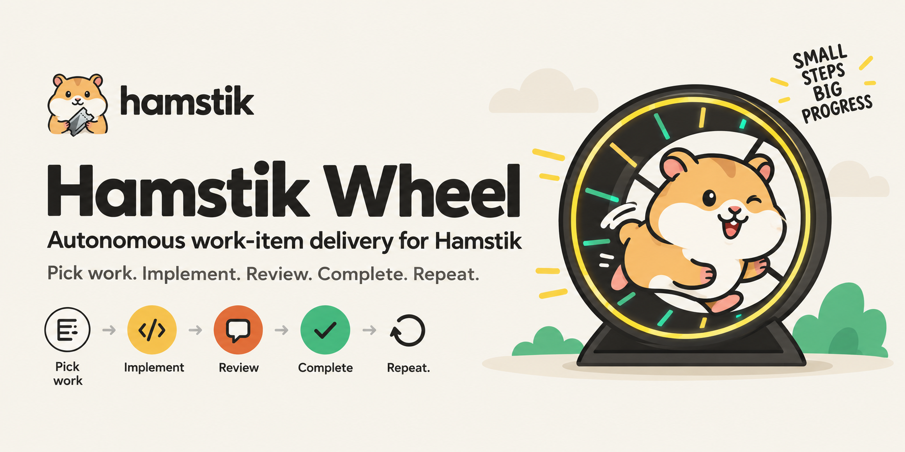
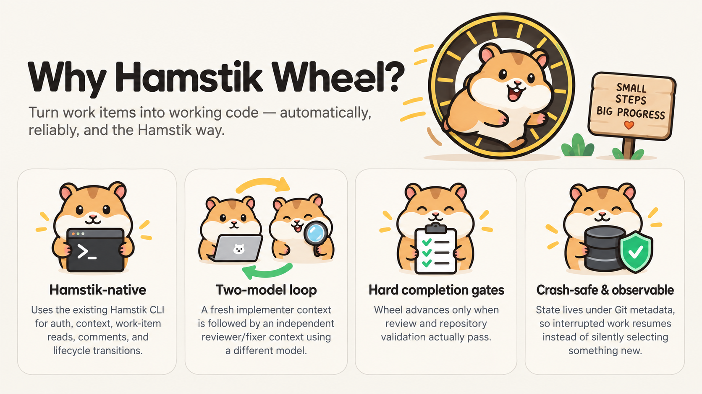
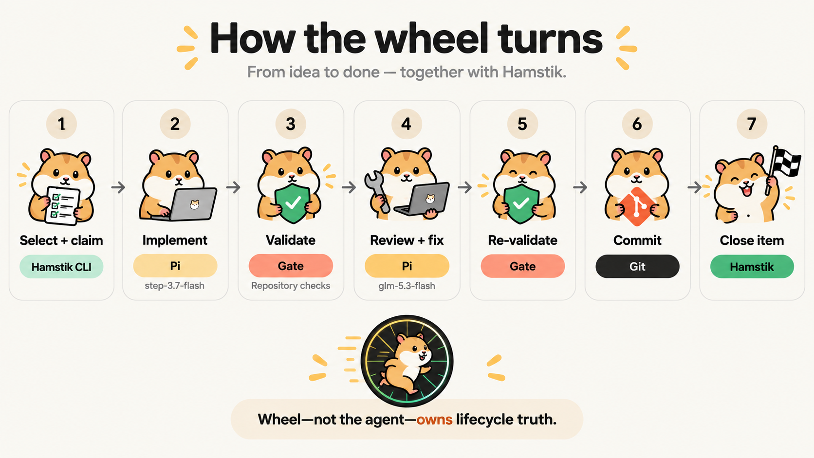

<p align="center">
  
</p>

Hamstik Wheel is a small, local autonomous orchestration tool for
[Hamstik](https://hamstik.com)-managed software projects. It turns a Hamstik
backlog into reviewed, committed code — one Work Item at a time, inside your
own repository, using your own validation tooling.

Wheel uses the existing [Hamstik CLI](https://github.com/blackboardstudios/hamstik-cli)
as its exclusive Hamstik integration boundary. For each eligible Work Item it
runs a Pi implementation session, validates the repository, runs a fresh,
independent Pi review/remediation session, validates again, commits the
result, asks Hamstik CLI to close the Work Item, and then repeats with the
next eligible item.

> **Status:** Early development. Hamstik Wheel is intentionally focused on a
> simple, observable, one-Work-Item-at-a-time autonomous delivery loop.

[](https://github.com/blackboardstudios/hamstik-wheel/actions/workflows/ci.yml)
[](LICENSE)

## Quick start

### Requirements

- Git
- The [Pi coding agent](https://github.com/earendil-works/pi) (`pi` on `PATH`)
- [Hamstik CLI](https://github.com/blackboardstudios/hamstik-cli) (`hamstik` on
  `PATH`, or configured through `[hamstik].cli_path`)
- A Rust toolchain when building from source (the repository pins `stable`
  through `rust-toolchain.toml`)
- A Git repository — Wheel always operates on the repository it is started in
- An authenticated Hamstik CLI with the desired Organization/Project context
  selected

Wheel does not manage Hamstik authentication. Sign in and select context with
Hamstik CLI (`hamstik auth login`, `hamstik context init --org acme --project
HAM`); Wheel inherits exactly what Hamstik CLI resolves at runtime.

### Build from source

Wheel is not yet published to crates.io or as release archives. Build it from
source:

```bash
git clone https://github.com/blackboardstudios/hamstik-wheel.git
cd hamstik-wheel
cargo build --release
./target/release/hamstik-wheel --version
```

Optionally install the binary into Cargo's binary directory:

```bash
cargo install --path . --locked
```

### Initialize a repository

From a repository already connected to the desired Hamstik Organization/Project:

```bash
hamstik-wheel init
$EDITOR .hamstik-wheel.toml
```

`init` writes the default configuration. Review the Work Item filters
(`[hamstik]`), the model pair (`[models]`), and — importantly — set
`[validation].commands` to the checks your repository defines. The checked-in
[.hamstik-wheel.toml.example](.hamstik-wheel.toml.example) shows an annotated
configuration.

### Run one Work Item

```bash
hamstik-wheel doctor
hamstik-wheel once
```

`doctor` verifies the whole dependency chain — Git, Pi, Hamstik CLI, the
required Hamstik command surface, both configured models, and repository
readiness — before any agent runs. `once` is the recommended way to establish
trust: it selects the single highest-priority eligible Work Item, implements
it, reviews it, commits, and closes it.

### Run the wheel

```bash
hamstik-wheel run --max-items 5
```

`run` repeats the same loop until the item limit is reached or no eligible
Work Items remain. Omitting `--max-items` uses `[loop].max_items` from the
configuration (10 by default).

## Why Hamstik Wheel?



- **Hamstik-native** — Hamstik CLI owns authentication, profile and context
  resolution, API compatibility, Work Item access, comments, and lifecycle
  transitions. Wheel holds no credentials and speaks no Hamstik HTTP.
- **Two-model loop** — implementation and review run in separate fresh Pi
  processes, each with its own configured model.
- **Hard completion gates** — an agent saying "done" is not sufficient.
  Repository validation and independent review must both pass before Wheel
  commits and closes the Work Item.
- **One Work Item at a time** — no fleets, worker pools, distributed
  schedulers, or worktree concurrency. The design is deliberately narrow.
- **Crash-safe and observable** — orchestration state lives under Git
  metadata, and interrupted work resumes instead of silently starting
  something new.

## How it works



```text
Hamstik Work Item
        ↓
    Hamstik CLI
        ↓
 Pi implementation session
        ↓
  repository validation
        ↓
 fresh Pi review/remediation session
        ↓
  repository validation
        ↓
      git commit
        ↓
Hamstik Work Item → Done
        ↓
 next eligible Work Item
```

**Wheel — not the agent — owns lifecycle truth.** Implementation and reviewer
agents never decide that a Work Item is Done, and both are explicitly
instructed not to change Work Item status, add Hamstik comments, or create Git
commits. Wheel advances the loop between phases, persists a phase marker after
every step, and calls Hamstik CLI to start or close the Work Item only after
the required gates succeed.

## Current capabilities

Today Hamstik Wheel provides:

- a project-local `.hamstik-wheel.toml` created by `init`;
- deterministic, LLM-free Work Item selection with configured status, type,
  and label filters;
- Hamstik integration exclusively through machine-readable Hamstik CLI
  surfaces, verified at runtime against the installed CLI's
  `hamstik commands --json` manifest;
- the `hamstik work context <KEY> --json` bundle as the authoritative agent
  input;
- separate implementation and review model configuration;
- a fresh Pi process for every implementation and review session;
- repository-defined validation commands, run before review and again after
  review passes;
- clean-working-tree protection before a new Work Item is selected
  (`require_clean_start`);
- a persisted baseline commit SHA for every active Work Item;
- Git commits owned by Wheel — agents are forbidden from committing;
- Work Item start/close transitions through Hamstik CLI;
- start and completion comments with baseline-keyed idempotency, each
  individually configurable;
- crash/resume orchestration state under Git metadata
  (`hamstik-wheel/state.json`);
- per-Work-Item agent and validation logs under Git metadata;
- live single-line agent activity rendering with elapsed time (TTY only);
- timestamped console output (`--timestamps local|utc|none`, local by default)
  with an optional `--log-file <PATH>` mirror of the whole run;
- `--max-items`, `max_review_cycles`, and the unattended-resilience options
  (`on_failure`, `agent_timeout_minutes`, `implement_retry`);
- `init`, `doctor`, `once`, `run`, `resume`, and `status`;
- `--timestamps` and `--log-file` output logging options.

Release packaging, a `docs/` tree, and multi-agent scale-out are future work;
concurrency beyond one Work Item is a non-goal by design.

## Commands

| Command | Purpose |
| --- | --- |
| `hamstik-wheel init` | Create `.hamstik-wheel.toml` in the current Git repository |
| `hamstik-wheel doctor` | Verify Git, Pi, Hamstik CLI, its command surface, configured models, and repository readiness |
| `hamstik-wheel once` | Process exactly one Work Item, resuming an active item first when needed |
| `hamstik-wheel run --max-items N` | Process Work Items sequentially until the requested/configured limit or no work remains |
| `hamstik-wheel resume` | Resume the interrupted active Work Item; errors when nothing is active |
| `hamstik-wheel status` | Show persisted loop state: phase, Work Item, baseline SHA, review cycle, last error |

`run` and `once` automatically resume an active Work Item before selecting a
new one; `resume` exists for when that should be the only thing that happens.
`--max-items` is optional and defaults to `[loop].max_items`.

## Output logging

All Wheel-generated progress lines (`Selected …`, `[claim]`, `[implement]`,
`[validate]`, `[review]`, `[commit]`, `[complete]`, doctor results, and errors)
can be timestamped and mirrored to a file. These are global options, accepted
before the subcommand:

```bash
hamstik-wheel --timestamps utc run --max-items 5
hamstik-wheel --log-file wheel-run.log once
hamstik-wheel --no-timestamps status
```

- `--timestamps local|utc|none` — prefix every Wheel line with a millisecond
  RFC 3339 timestamp. Defaults to `local`; `--no-timestamps` is shorthand for
  `--timestamps none`.
- `--log-file <PATH>` — additionally append everything Wheel prints (with the
  selected timestamps applied) to the given file. The file is opened in append
  mode and created (including parent directories) if missing, so repeated runs
  accumulate one continuous history.

Timestamps apply only to lines Wheel generates itself. Validation subprocess
output is streamed through verbatim — with a timestamp prefix — mirrored into
`--log-file` when enabled, and continues to be captured verbatim in the
per-Work-Item logs under Git metadata.

## Live agent activity

While an implementation or review session runs, Wheel renders a single
in-place console line showing what the agent is doing and for how long:

```text
[implement] CLI-52 with step-3.7-flash
[pi] ⠸ bash: cargo test --workspace · 0:03
[pi] ✓ finished · 4:12
```

- The line updates in place as the agent works — each `thinking…`,
  `calling …`, or `tool: argument` event replaces the description — and the
  elapsed clock keeps ticking between events.
- One final `[pi] ✓ finished · MM:SS` line is left in scrollback when the
  session ends, so a completed session costs exactly one line of history.
- Rendering requires an interactive terminal. With piped output (CI, logs,
  `--log-file`), the tracker is disabled entirely and nothing is rendered.
- Wheel launches Pi with `--mode json` to receive these events; `doctor` and
  `preflight` verify the installed Pi supports JSON output mode and fail with
  a clear error otherwise.
- The full event stream is captured verbatim in the per-Work-Item transcript
  logs under Git metadata (`hamstik-wheel/logs/<KEY>/…`), and the structured
  `HAMSTIK_WHEEL_RESULT` marker is extracted from the session's final
  assistant message.

## Configuration

Wheel reads `.hamstik-wheel.toml` from the repository root. It deliberately
contains no Hamstik URL, PAT, refresh token, or authentication configuration —
those belong to Hamstik CLI.

```toml
[hamstik]
# Path to the Hamstik CLI binary ("hamstik" via PATH when omitted).
cli_path = "hamstik"
# Candidate discovery is scoped to the Organization/Project selected by Hamstik CLI.
statuses = ["todo"]
item_types = ["task", "bug", "story", "feature"]
# Optional extra eligibility gate, e.g. ["agent-ready"].
label_names = []

[models]
# Any model identifier Pi can resolve is valid.
implement = "step-3.7-flash"
review = "glm-5.3-flash"

[validation]
# Commands run from the repository root; all must pass before completion.
commands = [
  "./scripts/do-prechecks.py",
]

[loop]
max_items = 10
max_review_cycles = 3
on_failure = "skip"
agent_timeout_minutes = 45
implement_retry = true

[git]
require_clean_start = true
commit = true
commit_message = "{key}: {title}"

[comments]
post_started = true
post_completed = true
```

- **`[hamstik]`** — how Wheel finds the CLI and which Work Items are eligible.
  Statuses are restricted to `backlog`, `todo`, `in_progress`, `in_review`,
  and `done`; types to `task`, `bug`, `story`, `feature`, and `epic`. Epics
  are excluded by default because Wheel should execute actionable child work.
- **`[models]`** — the two Pi models. Any model identifier Pi can resolve may
  be configured; `step-3.7-flash` and `glm-5.3-flash` are the defaults from
  the original local workflow, not requirements imposed by Hamstik.
- **`[validation]`** — shell commands run from the repository root (`sh -lc`
  on Unix, `cmd /C` on Windows); every command must exit 0. With no commands
  configured, `doctor` warns that the final gate relies on review only.
- **`[loop]`** — `max_items` bounds a `run` invocation when `--max-items` is
  omitted; `max_review_cycles` bounds review/remediation iterations per Work
  Item; `on_failure = "skip"` makes the run record the failure, restore the
  item's baseline tree, and continue with the next item instead of stopping
  (`"halt"` stops the run — the default); `agent_timeout_minutes` caps each
  agent session's wall-clock time (0 disables); `implement_retry` retries the
  implementation session once when it fails to produce a parsable result
  marker.
- **`[git]`** — `require_clean_start` blocks new selection on a dirty working
  tree; `commit` controls whether Wheel commits; `commit_message` supports the
  `{key}` and `{title}` placeholders.
- **`[comments]`** — post a comment when Wheel claims a Work Item and when it
  completes it.

## Work Item selection

Wheel intentionally does not use an LLM to decide what should be worked on
next. Candidates are discovered with `hamstik work list --status … --type …
--label-name … --all` inside the Organization/Project resolved by the Hamstik
CLI context, then ordered deterministically:

1. `in_progress` before backlog/todo when present in the candidate set;
2. priority from highest to lowest (`urgent`/`critical`/`highest`, `high`,
   `medium`/`normal`, `low`, `none`);
3. oldest creation time first when priority is equal;
4. Work Item key as a final stable tie-breaker.

A repository can make eligibility stricter with the configured filters, for
example `label_names = ["agent-ready"]`. That label convention is an optional
repository-side safeguard; Hamstik does not require it.

## Implementation and review model

```text
Work Item
   │
   ├── fresh Pi implementer
   │      model = [models].implement
   │
   └── fresh Pi reviewer/remediator
          model = [models].review
```

The implementation agent receives the authoritative
`hamstik work context <KEY> --json` bundle and the baseline Git SHA. It is
instructed to inspect the repository first, implement the Work Item
completely, add or update tests, keep changes scoped to the Work Item, and
continue any partial working-tree changes on a resumed run. It ends with a
structured `HAMSTIK_WHEEL_RESULT` marker reporting `ready_for_review` or
`blocked`.

The reviewer runs as a **fresh Pi process** with no shared conversation. The
reviewer independently inspects the Work Item, the Git diff against the
baseline, the repository architecture, tests, and acceptance criteria, plus
the pre-review validation evidence — rather than inheriting the implementer's
assumptions. It is authorized to edit the working tree to fix findings, and it
also ends with a structured marker: `pass` with zero findings, or `blocked`.

Wheel parses only the final structured marker from each session's event
stream; it does not read or interpret model reasoning for any other purpose.

## Completion gates

Successful completion is defined by the gates Wheel controls, not by an
agent's self-report:

```text
implementation complete
       ↓
pre-review validation passes
       ↓
independent review returns PASS (zero findings)
       ↓
remediation, if the reviewer reported findings
       ↓
final validation passes
       ↓
git commit succeeds
       ↓
Hamstik close succeeds
```

All configured validation commands must exit 0 before review and again after
the review passes. A reviewer `pass` that still reports findings is treated as
a failure and fed into the next review cycle, as is a failed final validation.
Review/remediation repeats up to `max_review_cycles`; if the loop never
converges, Wheel stops with an error, leaves the Work Item open, and keeps its
state persisted for inspection or `resume`.

### Unattended runs

`[loop].on_failure = "skip"` makes multi-item runs resilient: when an item
fails (agent error/timeout, non-converging review, `blocked` result), Wheel
posts a failure comment on the item, preserves the session's in-progress
changes on a `wheel/wip/<KEY>` branch (when any exist), restores the working
tree to that item's baseline, transitions the item back to `todo` so it
stays eligible for later runs, and continues with the next item. The run
summary reports how many items were skipped. Combined with
`agent_timeout_minutes` (a hung session is killed at the wall-clock cap) and
`implement_retry` (one extra session when the first attempt emits no
parsable result), a `run` can process a queue overnight: one bad item costs
that item, not the whole night. Skipped items keep their failure comment
and WIP branch for manual pickup or a later automated attempt.

When the gates pass, Wheel commits with `git add -A` and the configured
message template, records the commit SHA, and asks Hamstik CLI to close the
Work Item. With `commit = false`, Wheel closes the item and reports that the
changes were intentionally left uncommitted.

## Crash recovery

Wheel stores state using `git rev-parse --git-path
hamstik-wheel/state.json`, so orchestration state lives inside Git metadata
rather than the working tree: it never dirties the repository, is never
committed, and is resolved per worktree. Writes are atomic (temporary file +
rename), and agent output and validation evidence are captured under the same
metadata tree (`hamstik-wheel/logs/<KEY>/`).

If a machine or terminal dies mid-item:

```bash
hamstik-wheel status    # persisted phase, Work Item, baseline, review cycle, last error
hamstik-wheel resume    # continue the interrupted Work Item from its persisted phase
```

Resumed runs re-read the authoritative Work Item context so agent input stays
current. While an item's orchestration state is active, Wheel does not select
a new Work Item — `once` and `run` resume the active item first.

## Running unattended

tmux is deliberately optional:

```bash
tmux new -s hamstik-wheel
hamstik-wheel run --max-items 10
```

Detach with `Ctrl-b d` and reattach later with `tmux attach -t hamstik-wheel`.

tmux is only a durable terminal/session host. It is not part of Hamstik
Wheel's orchestration architecture — Wheel itself is a plain foreground
process, and its durable state lives in Git metadata.

## Relationship to Hamstik CLI

Wheel treats the installed `hamstik` binary as a local machine API
([ADR-0001](design/ADR-0001-hamstik-cli-boundary.md)) and invokes only
machine-facing commands, always with the global `--no-input --json` flags:

```text
hamstik doctor                       # dependency diagnostics before any agent runs
hamstik commands                     # manifest check for the required command surface
hamstik work list …                  # candidate discovery with configured filters
hamstik work context <KEY>           # authoritative agent input
hamstik work start <KEY>             # claim the Work Item
hamstik work comment add <KEY>       # start/completion comments (idempotency-keyed)
hamstik work close <KEY>             # close after all gates pass
```

Before any unattended run, Wheel verifies through `hamstik commands --json`
that the installed CLI provides every required command and advertises
`--json` and `--no-input` support for it.

Wheel intentionally does not contain Hamstik HTTP/API client code, PAT/token
persistence, profile handling, URL/server configuration, API compatibility or
model refresh logic, or duplicated Hamstik workflow semantics. Those
responsibilities remain in hamstik-cli, so authentication, context resolution,
retries, and redaction behave identically for manual and automated use.

## Design documents

The detailed product and technical direction lives under
[`design/`](design/):

- [`design/PRD.md`](design/PRD.md) — product requirements
- [`design/SPEC.md`](design/SPEC.md) — technical specification
- [`design/ADR-0001-hamstik-cli-boundary.md`](design/ADR-0001-hamstik-cli-boundary.md)
  — why Hamstik CLI is the sole Hamstik integration boundary

`design/` holds internal product/architecture artifacts; user-facing
documentation belongs in this README or a future `docs/` tree.

## Contributing

Contributions are welcome — see [CONTRIBUTING.md](CONTRIBUTING.md).

## License

Hamstik Wheel is open-source software licensed under [Apache-2.0](LICENSE).

## Trademark

Hamstik and the Hamstik logo are trademarks of Blackboard Studios.
